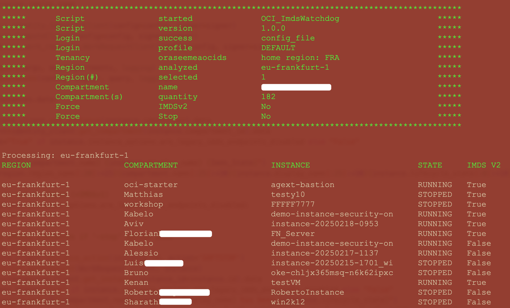
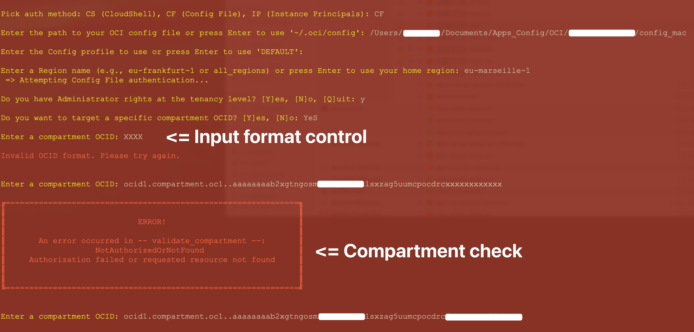

# OCI_IMDS-Watchdog

The instance metadata service is available in two versions, version 1 and version 2. 

[Instance metadata service to v2](https://docs.oracle.com/en-us/iaas/Content/Compute/Tasks/gettingmetadata.htm#upgrading-v2) offers increased security compared to v1. 
We **strongly** recommend you disable IMDSv1 and allow requests only to IMDSv2

This script will:

- Print a report of compute instances indicating IMDS version used (no change, just report)
- Stop compute instances using IMDSv1 when '-stop' argument is used
- Update compute instances using IMDSv1 to IMDSv2 when '-update' argument is used
- Create a report in ./imds-report_YYYY-MM-DD_hh-mm.log

## How-to 

You can run this script without any argument:

	python3 ./OCI_ImdsWatchdog.py

When no arguments are provided, OCI_ImdsWatchdog **automatically**:

- Attempts to authenticate using all available authentication methods:

    1- CloudShell authentication
    
    2- Config_File authentication
    
    3- Instance_Principal authentication

    4- If all authentication fail, prompts the user to provide a config_file custom path and a config_profile section.

- Asks which region to use
	- Using '-region' option will bypass this question
- Asks if the user is a tenancy Admin
	- If user is not a tenancy Admin, asks for a compartment OCID
	- Using '-su' option will bypass this question

## Script options:

OCI_ImdsWatchdog can be fully automated using the following arguments:

- Enforce an authentication method, **-auth cs** | **cf** | **ip**
- Tenant administrators can bypass the 'Admin question' using **-su**
- Non-admin users can specify their own compartment ocid **-comp ocid1.xxxx**
- Select a specific subscribed region instead of the home region **-region eu-frankfurt-1**
- Target all subscribed regions **-region all_regions**
- Force IMDSv2 update using **-update**
- Force stopping IMDSv1 instances using **-stop**

## Optional parameters for execution:

| Argument      | Parameter            | Description                                                                                        |
| -----------   | -------------------- | -------------------------------------------------------------------------------------------------- |
| -auth         | auth_method          | Force an authentication method : 'cs' (cloudshell), 'cf' (config file), 'ip' (instance principals) | 
| -config_file  | config_file_path     | Path to your OCI config file, default: '~/.oci/config'                                             |
| -profile      | config_profile       | Config file section to use, default: 'DEFAULT'                                                     | 
| -su           |                      | If you have tenancy-level admin rights this will allow Root compartment analysis                   | 
| -comp         | compartment_ocid     | Filter on a compartment for non-admins or admins willing to filter on a specific compartment       | 
| -region       | region_name          | Region name to analyze, e.g. "eu-frankfurt-1" or "all_regions", default: 'home_region'             | 
| -update       |                      | Force IMDSv2 only on compute instances                                                             | 
| -stop         |                      | Force IMDSv1 compute instances to be stopped                                                       | 

## Examples of Usage
##### Default :
```
python3 ./OCI_ImdsWatchdog.py
```
try all authentication methods

##### Authenticate using a config_file stored in a custom location:
```
python3 ./OCI_ImdsWatchdog.py -auth cf -config_file /path/to/config_file 
```
##### Select a subscribed region other than the Home Region:
```
python3 ./OCI_ImdsWatchdog.py -region eu-paris-1
```
##### Select all subscribed regions:
```	
python3 ./OCI_ImdsWatchdog.py -region all_regions
```	
##### Using multiples parameters:

```
python3 ./OCI_ImdsWatchdog.py \
-auth cf \
-config_file ~/Documents/config/my_config \
-profile DEFAULT \
-region eu-paris-1 \
-su \
-update
```

# Setup

##### Download script locally

```
python3 -m pip install oci -U --user
git clone https://github.com/Olygo/OCI_IMDS-Watchdog
```

If you run this script from an OCI compute instance you should use [Instance Principal authentication](https://docs.public.oneportal.content.oci.oraclecloud.com/en-us/iaas/Content/Identity/Tasks/callingservicesfrominstances.htm).

When using Instance Principal authentication, you need to create the following resources:

##### Dynamic Group

- Create a Dynamic Group called OCI_Scripting and add the OCID of your instance to the group, using :

```
ANY {instance.id = 'OCID_of_your_Compute_Instance'}
```	

##### Policy

- Create a policy in the root compartment, giving your dynamic group the permissions to read resources in tenancy:

```
allow dynamic-group 'Your_Identity_Domain_Name'/'OCI_Scripting' to manage instance-family in tenancy
```

# Screenshots

##### Script output



##### If you run the script without parameters :



## Questions and Feedbacks ?
**_olygo.git@gmail.com_**

## Disclaimer
**Always ensure thorough testing of any script on test resources prior to deployment in a production environment to avoid potential outages or unexpected costs. The OCI_ComputeCapacityReport script does not interact with or create any resources in your existing environment.**

**This script is an independent tool developed by Florian Bonneville and is not affiliated with or supported by Oracle. 
It is provided as-is and without any warranty or official endorsement from Oracle**
